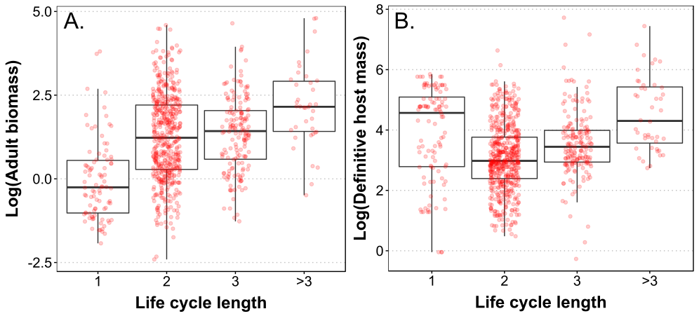

## Long life cycle, large worms?

This analysis examines why some complex life cycle parasites wait to reproduce until they are transmitted up the food chain. A previous [study](http://rspb.royalsocietypublishing.org/content/281/1793/20141462) found that nematode worms have longer life cycles if they reproduce in apex predators. But what do worms gain by this, as opposed to reproducing in lower level hosts? A presumed benefit of a long, multi-host life cycle is that parasites reach big predators, in which they can grow to a large and fecund reproductive size. That is, a long life cycle is rewarded with a large body size and higher egg output. I examine this presumed benefit using a [database](http://onlinelibrary.wiley.com/doi/10.1002/ecy.1680/suppinfo) of helminth (parasitic worm) life cycles, and found that it is only marginal. I also explore how adult parasite size relates to definitive host mass and trophic level. The analysis can be read [here](adult_size_lcl.md)

