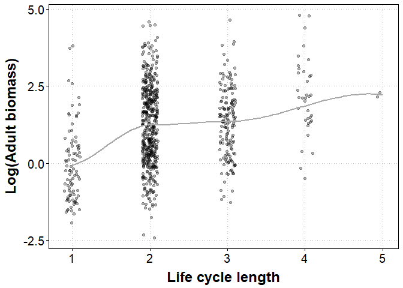
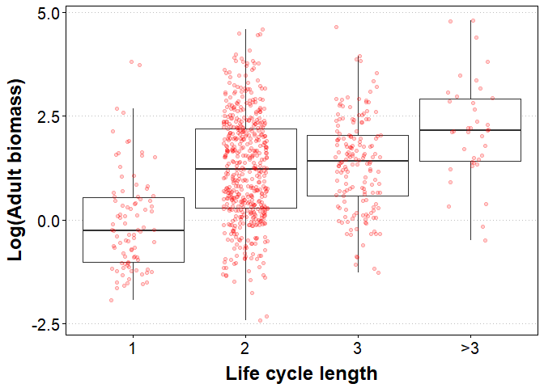
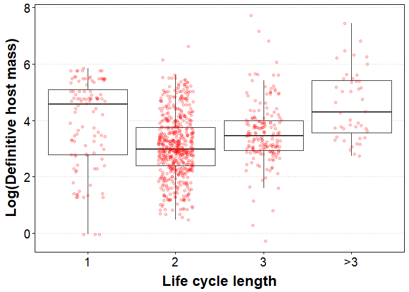
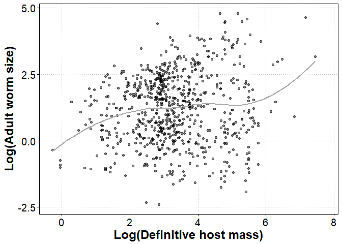
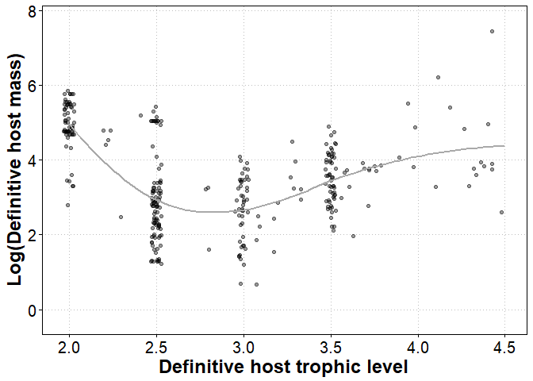
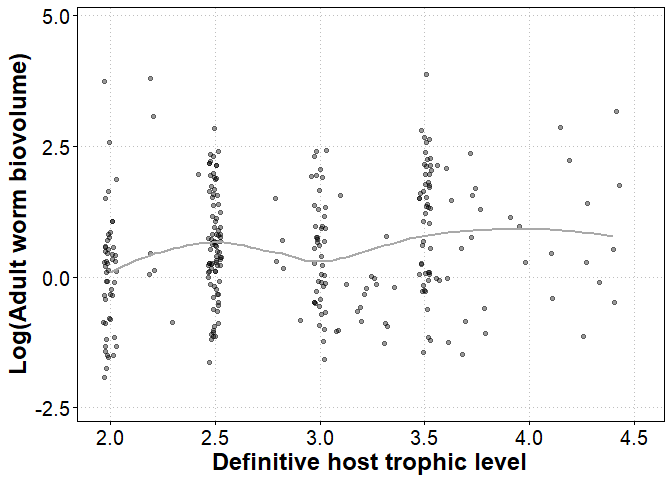

Long life cycles and parasite reproductive sizes
================

**Background**: A presumed benefit of a long, multi-host life cycle is that parasites reach big, high trophic levels, in which they can grow to a large and fecund reproductive size. That is, a long life cycle is rewarded with a large body size and higher egg output. I examine this presumed benefit using a [database](http://onlinelibrary.wiley.com/doi/10.1002/ecy.1680/suppinfo) of helminth (parasitic worm) life cycles. Then, I explore how adult parasite size relates to definitive host mass and trophic level.

**Analysis** First, import the libraries and the life cycle database.

``` r
library(dplyr)
library(ggplot2)
library(tidyr)
library(RColorBrewer)

options(stringsAsFactors = FALSE) # never have species lists as factors; always as character vectors

# set theme
theme.o <- theme_update(axis.text = element_text(colour="black", size = 15),
                        axis.title = element_text(colour="black", size = 18, face = "bold", lineheight=0.25),
                        axis.ticks = element_line(colour="black"),
                        panel.border = element_rect(colour = "black",fill=NA),
                        panel.grid.minor=element_blank(),
                        panel.grid.major=element_line(color="gray",linetype = "dotted"),
                        panel.background= element_rect(fill = NA))

# import the life cycle database data tables
dataH <- read.csv(file="data/CLC_database_hosts.csv", header = TRUE, sep=",")
dataL <- read.csv(file="data/CLC_database_lifehistory.csv", header = TRUE, sep=",")
```

We are interested in adult sizes, so we'll restrict the data to worms in their definitive hosts. We also remove measurements on adult males, as, unlike females, their body size is presumably not strongly correlated with fecundity (i.e. male reproductive success may be driven by other factors like intraspecific competition for mates).

``` r
# filter to adult stages
dataL <- filter(dataL, Stage == 'adult', (Sex == 'f' | is.na(Sex)) ) # remove adult males
```

Then we calculate parasite biovolume based on length, width, and shape, convert it to a mass, and calculate the average for each parasite species.

``` r
dataL <- mutate(dataL, biovolume = 
                  if_else(Shape %in% c("cylinder", "thread-like", "whip"), 
                          pi * (Width/2)^2 * Length, # calculate volume as a cylinder
                          if_else(Shape %in% c("coiled", "sphere", "ellipsoid"),
                                  4/3 * pi * Length/2 * Width/4, # calculate volume as a ellipsoid
                                  Length * Width # calculate volume as area for remaining ribbon, leaf shapes
                                  )),
                biovolume = biovolume * 1.1) # covert to biomass with assumed 1.1. g/cm3 tissue density 

# species averages
dataL.sp <- group_by(dataL, Parasite.species)%>%
  summarize(Biovolume = mean(biovolume, na.rm=T))
```

The species-level data now contains 967 species instead of the original 973. A few were removed because they only had measurements for adult males. Next, we add life cycle lengths to the adult sizes.

``` r
maxLCL <- group_by(dataH, Parasite.species)%>%summarize(maxLCL = max(Host.no))
minLCL <- filter(dataH, Facultative == "no")%>%
  group_by(Parasite.species)%>%summarise(minLCL = length(unique(Host.no)))
dataL.sp <- left_join(dataL.sp, maxLCL)
dataL.sp <- left_join(dataL.sp, minLCL)
rm(minLCL, maxLCL)
```

Visualize the relationship between adult parasite size and life cycle length.

``` r
#let's try a scatter plot first
ggplot(data = dataL.sp,
       aes(x = maxLCL, y = log10(Biovolume))) +
  geom_point(alpha = 0.3, position = position_jitter(height = 0, width = 0.1)) +
  geom_smooth(se = F, color = 'darkgrey') +
  labs(y="Log(Adult biomass)\n", x="\nLife cycle length") 
```



It is positive, as expected. However, for a given life cycle length, there is substantial body size variation. For example, worms with 2-host life cycles can be relatively small or relatively large. Also, the biggest difference appears to be between 1- and 2-host cycles, with less increase thereafter.

A simple linear regression confirms that the correlation is significantly positive. However, only 9% of the variation is explained by life cycle length.

``` r
mdl1 <- (lm(log10(Biovolume) ~ maxLCL, data = dataL.sp))
summary(mdl1)
```

    ## 
    ## Call:
    ## lm(formula = log10(Biovolume) ~ maxLCL, data = dataL.sp)
    ## 
    ## Residuals:
    ##     Min      1Q  Median      3Q     Max 
    ## -3.4605 -0.9039 -0.0778  0.9282  3.5395 
    ## 
    ## Coefficients:
    ##             Estimate Std. Error t value Pr(>|t|)    
    ## (Intercept) -0.09033    0.14776  -0.611    0.541    
    ## maxLCL       0.57137    0.06432   8.883   <2e-16 ***
    ## ---
    ## Signif. codes:  0 '***' 0.001 '**' 0.01 '*' 0.05 '.' 0.1 ' ' 1
    ## 
    ## Residual standard error: 1.263 on 792 degrees of freedom
    ##   (173 observations deleted due to missingness)
    ## Multiple R-squared:  0.09061,    Adjusted R-squared:  0.08946 
    ## F-statistic: 78.91 on 1 and 792 DF,  p-value: < 2.2e-16

We can also make a boxplot, which shows the non-linearities more clearly, such as the lack of a difference between 2- and 3-host cycles. The plot includes 794 species.

``` r
# make life cycle length a factor and pool the few parasites with life cycles longer than three hosts
dataL.sp <- mutate(dataL.sp, maxLCL.fac = if_else(maxLCL > 3, "4", as.character(maxLCL)))%>%
  mutate(maxLCL.fac = factor(maxLCL.fac, labels = c("1", "2", "3", ">3")))
```

``` r
# boxplot with data points as overlay
outfig <- ggplot(data = dataL.sp,
                 aes(x = maxLCL.fac, y = log10(Biovolume))) + 
  geom_boxplot(outlier.color = "white", width = 0.9) +
  geom_jitter(width = 0.2, color = "red", alpha = 0.2) +
  labs(y="Log(Adult biomass)\n", x="\nLife cycle length") + 
  theme(panel.grid.major.x = element_blank())
outfig
```



``` r
# save svg and png of fig for a word doc
ggsave(filename = "figs/adultsize_vs_lcl.png", width = 5, height = 4.5, units = "in")
ggsave(filename = "figs/adultsize_vs_lcl.svg", width = 5, height = 4.5, units = "in")
```

Because of this non-linear pattern, a model treating life cycle length as a categorical variable instead of a continuous one is an improvement. Still, the explained variance only increases from 9 to 13%, so there is substantial variation in adult helminth size that is unrelated to life cycle length.

``` r
mdl2 <- lm(log10(Biovolume) ~ maxLCL.fac, data = dataL.sp)
anova(mdl1, mdl2)
```

    ## Analysis of Variance Table
    ## 
    ## Model 1: log10(Biovolume) ~ maxLCL
    ## Model 2: log10(Biovolume) ~ maxLCL.fac
    ##   Res.Df    RSS Df Sum of Sq      F   Pr(>F)    
    ## 1    792 1263.7                                 
    ## 2    790 1207.6  2    56.105 18.352 1.62e-08 ***
    ## ---
    ## Signif. codes:  0 '***' 0.001 '**' 0.01 '*' 0.05 '.' 0.1 ' ' 1

To better understand this pattern (or lack thereof), let's check our assumptions. Are parasites with longer life cycles really reproducing in bigger hosts? And are parasites bigger in bigger hosts? Let's add definitive host masses to our data table.

``` r
# host mass dataset
host.size <- read.csv(file="data/collated_host_mass_data.csv", header = TRUE, sep=",")

# host size either a length or a mass; restrict to just masses
host.size <- filter(host.size, !is.na(body.mass))%>%
  select(binomial, body.mass)%>%
  group_by(binomial)%>%
  summarize(body.mass = mean(body.mass)) # some species have multiple entries, so avg them

# filter host list to just adult stages
dataH <- filter(dataH, Def.int == 'def', Typical.host == 'typical') # just typical definitive hosts

# add host mass data to host species
dataH <- left_join(dataH, host.size, by = c("Host.species" = "binomial"))

# average host mass for each parasite species
dataH <- group_by(dataH, Parasite.species)%>%
  summarise(host.mass = mean(body.mass, na.rm=T))

# add host mass to life cycle data
dataL.sp <- left_join(dataL.sp, dataH)
```

Definitive host masses are available for 879 parasite species. Are parasites with long life cycles reproducing in large hosts? Yes and no. The boxplot below shows the relationship. If we ignore worms with one-host cycles, there does appear to be a relationship between having a long cycle and reproducing in a large host. However, parasites with simple cycles infect hosts that are much larger than expected (mainly grazing mammals). Perhaps this is the only way simple life cycles are viable. Infecting a large final host is a way to compensate for not having an intermediate host to consume parasite propagules and aid transmission.

``` r
outfig <- ggplot(dataL.sp,
                 aes(x = maxLCL.fac, y = log10(host.mass))) + 
  geom_boxplot(outlier.color = "white", width = 0.9) +
  geom_jitter(width = 0.2, color = "red", alpha = 0.2) +
  labs(y="Log(Definitive host mass)\n", x="\nLife cycle length") + 
  theme(panel.grid.major.x = element_blank())
outfig
```



``` r
# save svg and png of fig for a word doc
ggsave(filename = "figs/defhostmass_vs_lcl.png", width = 5, height = 4.5, units = "in")
ggsave(filename = "figs/defhostmass_vs_lcl.svg", width = 5, height = 4.5, units = "in")
```

However, the idea that simple-cycle parasites compensate for poor transmission by growing large in a big final host, is undercut When we plot adult worm size vs definitive host mass. We see a positive, but messy relationship (r2 ~ 0.015). In other words, infecting a big host is no guarantee that parasites will grow large themselves.

``` r
ggplot(dataL.sp,
       aes(x = log10(host.mass), y = log10(Biovolume))) + 
  geom_point(alpha = 0.5) +
  geom_smooth(se = F, color = 'darkgrey') +
  labs(x = "Log(Definitive host mass)", y = "Log(Adult worm size)")
```



A predicted benefit of long life cycles is that these parasites reach large definitive hosts, where they themselves can grow to large, fecund sizes. These assumptions need to be re-evaluated. Many parasites with short cycles reproduce in large definitive hosts, and many parasites in large hosts have small reproductive sizes. Consequently, there is not a strong relationship between life cycle length and eventual worm reproductive size.

[Benesh et al. (2014)](http://rspb.royalsocietypublishing.org/content/suppl/2014/09/09/rspb.2014.1462.DC1.html%20) found that nematodes reproducing in high trophic level hosts have longer life cycles on average. In that paper, we argued that high trophic level hosts (top predators) are usually large, and thus may support parasites growing to a large size. In food webs, there is a correlation between body size and trophic level. But does this also apply to the definitive hosts of helminths? In other words, is it valid to assume that high trophic level hosts are also big ones? Let's import the trophic level data from that study. Trophic levels are only available for a fraction of the parasites, as the Benesh et al. 2014 was restricted to nematodes.

``` r
# trophic level data from my tropic vacuum study
host.tl <- read.csv(file = "data/TV_dryad.csv", header = TRUE, sep = ",")

# reduce to needed variables
host.tl <- select(host.tl, Parasite.species = Species, Min_TL, Max_TL, Avg_TL)

#add host trophic levels to life history data
dataL.sp <- left_join(dataL.sp, host.tl)
```

Here is the relationship between definitive host trophic level and host body size.

``` r
ggplot(dataL.sp, aes(x = Avg_TL, y = log10(host.mass))) + 
  geom_point(alpha = 0.4, position = position_jitter(width = 0.03, height = 0)) +
  geom_smooth(se = F, color = 'darkgray') +
  labs(x = "Definitive host trophic level", y = "Log(Definitive host mass)")
```



The correlation between host trophic level and body size is non-linear. When parasites reproduce in herbivores (trophic level = 2), they tend to be large herbivores. But when they produce in omnivores and predators (trophic level &gt; 2), then there is more of a correlation between host trophic level and mass. That is, high trophic level hosts are large, but only if they are not herbivores.

Given this complex relationship between host trophic level and size, as well as the weak relationship between host size and parasite size, it is perhaps not surprising that adult nematode size is not strongly related to definitive host trophic level (r2 = 0.026).

``` r
#correlation between def host TL and worm size
ggplot(dataL.sp, aes(x = Avg_TL, y = log10(Biovolume))) + 
  geom_point(alpha = 0.4, position = position_jitter(width = 0.03, height = 0)) +
  geom_smooth(se = F, color = 'darkgray') +
  labs(x = "Definitive host trophic level", y = "Log(Adult worm biovolume)")
```



``` r
summary(lm(log10(Biovolume) ~ Avg_TL, data = dataL.sp)) # sig but r2 of 2%
```

    ## 
    ## Call:
    ## lm(formula = log10(Biovolume) ~ Avg_TL, data = dataL.sp)
    ## 
    ## Residuals:
    ##     Min      1Q  Median      3Q     Max 
    ## -2.2807 -0.7968 -0.0307  0.7692  3.4559 
    ## 
    ## Coefficients:
    ##             Estimate Std. Error t value Pr(>|t|)   
    ## (Intercept)  -0.3047     0.3140   -0.97  0.33266   
    ## Avg_TL        0.2961     0.1073    2.76  0.00616 **
    ## ---
    ## Signif. codes:  0 '***' 0.001 '**' 0.01 '*' 0.05 '.' 0.1 ' ' 1
    ## 
    ## Residual standard error: 1.141 on 287 degrees of freedom
    ##   (678 observations deleted due to missingness)
    ## Multiple R-squared:  0.02585,    Adjusted R-squared:  0.02245 
    ## F-statistic: 7.615 on 1 and 287 DF,  p-value: 0.006159

As a last exercise, let's reduce the data frame to just the nematode species with adult size, host mass, and host trophic level data available. Then we fit an array of models to the data to get an idea of which variables best explain adult parasite size.

``` r
library(MuMIn) # load library for mult-model inference

data.nem <- na.omit(dataL.sp) # restrict to complete data, i.e. just nematodes

global.mod <- lm(log10(Biovolume) ~ log10(host.mass) + Avg_TL + maxLCL +
                 I(Avg_TL^2) + I(log10(host.mass)^2) + maxLCL.fac,
                 data = data.nem, na.action = "na.fail") # global model
```

``` r
# dredge the model set
model.set <- dredge(global.mod, subset = 
                      dc(log10(host.mass), I(log10(host.mass)^2)) && # only include quadratic if linear included
                      dc(Avg_TL, I(Avg_TL^2)) && # only include quadratic if linear included
                      xor(maxLCL, maxLCL.fac)) # do not include continuous and categorical lcl var in same model

subset(model.set, cumsum(weight) <= .95) # 95% ci set
```

    ## Global model call: lm(formula = log10(Biovolume) ~ log10(host.mass) + Avg_TL + maxLCL + 
    ##     I(Avg_TL^2) + I(log10(host.mass)^2) + maxLCL.fac, data = data.nem, 
    ##     na.action = "na.fail")
    ## ---
    ## Model selection table 
    ##       (Int)    Avg_TL Avg_TL^2 l10(hst.mss) l10(hst.mss)^2    mLC mLC.fac
    ## 17 -0.42280                                                0.4990        
    ## 21 -0.61770                         0.05431                0.5018        
    ## 18 -0.39320 -0.016330                                      0.5071        
    ## 33  0.04561                                                             +
    ## 29 -0.37480                        -0.10890        0.02277 0.5102        
    ## 24 -3.43900  1.829000 -0.30050      0.12110                0.4713        
    ## 22 -0.62970  0.005790               0.05471                0.4990        
    ## 37 -0.20590                         0.06296                             +
    ## 20 -1.19300  0.553600 -0.09532                             0.5014        
    ## 32 -3.52800  2.154000 -0.35080     -0.15020        0.03957 0.4713        
    ## 34  0.05523 -0.004208                                                   +
    ## 30 -0.40410  0.017610              -0.11250        0.02343 0.5017        
    ## 40 -3.19000  1.926000 -0.31400      0.12940                             +
    ##    df   logLik  AICc delta weight
    ## 17  3 -402.650 811.4  0.00  0.278
    ## 21  4 -402.180 812.5  1.12  0.159
    ## 18  4 -402.643 813.4  2.05  0.100
    ## 33  5 -401.856 813.9  2.55  0.078
    ## 29  5 -401.995 814.2  2.83  0.068
    ## 24  6 -401.031 814.4  2.99  0.062
    ## 22  5 -402.179 814.6  3.20  0.056
    ## 37  6 -401.286 814.9  3.50  0.048
    ## 20  5 -402.460 815.1  3.76  0.043
    ## 32  7 -400.510 815.5  4.06  0.037
    ## 34  6 -401.855 816.0  4.64  0.027
    ## 30  6 -401.987 816.3  4.91  0.024
    ## 40  8 -400.047 816.7  5.26  0.020
    ## Models ranked by AICc(x)

All of the top models include life cycle length (as either a continuous or categorical variable), and they may or may not contain host mass and trophic level. This suggests that life cycle length explains variation in nematode size that is not explained by the def host attributes. Perhaps long life cycles just give parasites more opportunity to grow (i.e. a little in each host). However, even in the 'global model', which is obviously overfit, only 13% of the variation in adult parasite size is explained. Maybe other factors like definitive host immunity, interspecific competition, or phylogenetic constraints strongly shape adult parasite size. In any case, a large, high-trophic level final host does not seem to come with the benefit of a larger body size for helminths.
